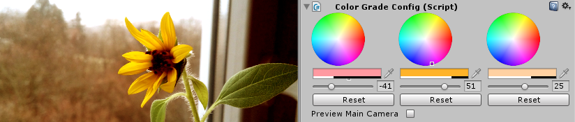
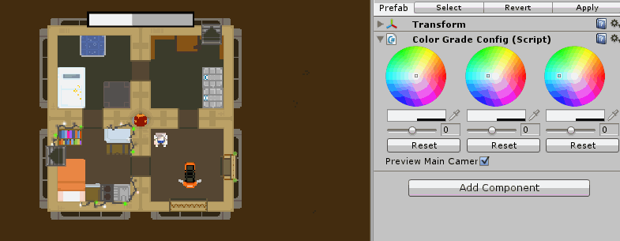

# Color Grading for Unity

Set HSV levels for shadows, midtones and highlights.

Direct preview in edit mode.

Low quality GIF showcase:

## Example

Download [ColorGrade.unitypackage](ColorGrade.unitypackage).

Created on Unity 5.3.6f1

## How it works

- postprocessing shader based on standard Image Effects is applied to main camera
- shader is supplid with settings from a specific ColorGradeConfig
- you can switch between multiple ColorGradeConfigs with a lerp

Based on [Color Grading](http://registry.gimp.org/node/26187) plugin for GIMP by johnlak.
Should give similar results.

## Authors

Created by [Jaroslav Meloun](http://www.twitter.com/jarnik), based on [Color Grading](http://registry.gimp.org/node/26187) plugin for GIMP by johnlak. 
Using level mapping functions from GIMP.
